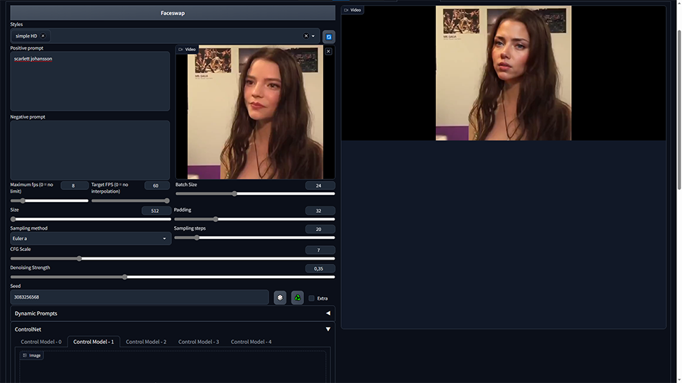

## vid-faceswap

This extension is for AUTOMATIC1111's [Stable Diffusion web UI](https://github.com/AUTOMATIC1111/stable-diffusion-webui).
It adds a tab dedicated to faceswapping of videos.



|Input|Output|
|---|---|
| [](https://youtu.be/G7Heh2G_w_A) | [](https://youtu.be/_D735PrNRdU) |

### Install

1. Open "Extensions" tab.
2. Open "Install from URL" tab in the tab.
3. Enter URL of this repo to "URL for extension's git repository".
4. Press "Install" button.
5. (optional) install rife-ncnn-vulkan-python
6. Restart Web UI.

#### What is rife-ncnn-vulk-python and how to install it ?

RIFE stands for Real-Time Intermediate Flow Estimation. This will allows you to turn a video with a low fps to a video with high fps. 

vid-faceswap uses it to save stable-diffusion image generations, which are costly, and then interpolate the missing frames. This also leads to better videos with less temporal incoherence issues.

On linux, you can simply run the following command:
```pip install rife-ncnn-vulkan-python```

On windows, pip will likely give you an error, as it will not be able to compile rife. So, instead you can [download the last version of RIFE](https://github.com/media2x/rife-ncnn-vulkan-python/releases). Don't forget to click "show all assets" if windows versions do not show up. Extract the whl file contained in the zip and run the command: ```pip install path-to-extracted-whl-file```

### Usage tips

- Maximum FPS will limit the number of frames that will be processed by stable diffusion. For example, if you have a 30 fps video and you set maximum fps to 10, it will only process 1/3 of the frames, saving as much computational time, energy, etc...
- Target FPS uses RIFE to bring the fps of the output video to that number of fps. For example, if you have a 30 fps video, and you've set maximum fps to 10, but also set target fps to 60, you'll end up with a 60 fps video for 1/6 of the computational cost.
- It's generally a good idea to set a low maximum fps and high target fps. This helps reduce temporal incoherence.
- A relatively low denoising strength is basically needed if you want to avoid as much temporal incoherence as possible. But you can go as high as you want, especially if you use controlnet. Feel free to experiment.

### Supported file formats

- Anything supported by ffmpeg (mp4, mkv, webm, gif, etc.) 
- Animated webp